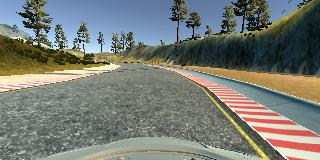

#**Behavioral Cloning**

##Writeup Template

###You can use this file as a template for your writeup if you want to submit it as a markdown file, but feel free to use some other method and submit a pdf if you prefer.

---

**Behavioral Cloning Project**

The goals / steps of this project are the following:
* Use the simulator to collect data of good driving behavior
* Build, a convolution neural network in Keras that predicts steering angles from images
* Train and validate the model with a training and validation set
* Test that the model successfully drives around track one without leaving the road
* Summarize the results with a written report


[//]: # (Image References)

[image1]: ./examples/placeholder.png "Model Visualization"
[image2]: ./examples/placeholder.png "Grayscaling"
[image3]: ./examples/placeholder_small.png "Recovery Image"
[image4]: ./examples/placeholder_small.png "Recovery Image"
[image5]: ./examples/placeholder_small.png "Recovery Image"
[image6]: ./examples/placeholder_small.png "Normal Image"
[image7]: ./examples/placeholder_small.png "Flipped Image"

---
###Files Submitted & Code Quality

####1. Submission includes all required files and can be used to run the simulator in autonomous mode

My project includes the following files:
* model.py containing the script to create and train the model
* drive.py for driving the car in autonomous mode
* model.h5 containing a trained convolution neural network
* writeup_report.md or writeup_report.pdf summarizing the results

####2. Submission includes functional code
Using the Udacity provided simulator and my drive.py file, the car can be driven autonomously around the track by executing
```sh
python drive.py model.h5
```

####3. Submission code is usable and readable

The model.py file contains the code for training and saving the convolution neural network. The file shows the pipeline I used for training and validating the model, and it contains comments to explain how the code works.

###Model Architecture and Training Strategy

####1. An appropriate model architecture has been employed

I selected the nVidia architecture with the following layers:

| Layer | Size |
|--|--|
|Convolution|24, 5x5 kernel, 2x2 stride|
|Convolution|36, 5x5 kernel, 2x2 stride|
|Convolution|48, 5x5 kernel, 2x2 stride|
|Convolution|64, 3x3 kernel, 1x1 stride|
|Convolution|64, 3x3 kernel, 1x1 stride|
|Flatten|
|Fully Connected|100|
|Fully Connected|50|
|Fully Connected|10|
|Fully Connected|1|

####2. Attempts to reduce overfitting in the model

The model was trained and validated on samples randomly drawn from the whole data sets to ensure that the model was not overfitting. There is a number of preprocessing and data augmentation tasks that are conducted on the fly to ensure that the model is exposed to different data.

The model was tested by running it through the simulator and ensuring that the vehicle could stay on the track through multiple laps.

####3. Model parameter tuning

The model used an adam optimizer, so the learning rate was not tuned manually (model.py line 25).

In addition, the following parameters are tuned
- batch size
- samples per epoch
- probability of flipping an image
- probability of adding a shadow
- probability of adjusting brightness
- probability of dropping images with small angles
- epoch
- dropout keep_prob but ultimately dropout was not used

####4. Appropriate training data

Training data was chosen to keep the vehicle driving on the road. I used a combination of the Udacity data set plus a recovery data set performed on my own.

For details about how I created the training data, see the next section.

###Model Architecture and Training Strategy

####1. Solution Design Approach

The overall strategy for deriving a model architecture was to iterate quickly and identify where the maximum gain could come from.

My first step was to use a simple 1-layer fully connected on Udacity's standard data set with no pre-processing or augmentation. The loss, as expected, was massive, but I was able to complete the end-to-end process of recording data and driving in autonomous mode.

The next step was to combine some minimal processing with the nVidia architecture. Images were centered and resized to 66x200 to feed through this architecture. In order to gauge how well the model was working, I split my image and steering angle data into a training and validation set.

The second model performed much better but was unable to drive around the track. I tried dropout but didn't achieve much success. This led me to believe that better results would be achieved with more effort on the data side.

I proceeded with a generator that augments data on the fly, initially with flipping the image and then add a random brightness adjustment. With these two changes, the car was able to drive around fully autonomously in the first track.

My next task was to try to get it to drive the challenge track without having seen it. To achieve this, I added a recovery data set and random dropping of low-angle images to account for the fact that there are a lot more sharp turns in this track.

Unfortunately, the result was inconsistent, depending on the model and initialization, sometimes the car was able to drive the whole track, sometimes it was not.

####2. Final Model Architecture

The final model architecture (model.py lines 18-24) consisted of a convolution neural network with the following layers and layer sizes ...

| Layer | Size |
|--|--|
|Convolution|24, 5x5 kernel, 2x2 stride|
|Convolution|36, 5x5 kernel, 2x2 stride|
|Convolution|48, 5x5 kernel, 2x2 stride|
|Convolution|64, 3x3 kernel, 1x1 stride|
|Convolution|64, 3x3 kernel, 1x1 stride|
|Flatten|
|Fully Connected|100|
|Fully Connected|50|
|Fully Connected|10|
|Fully Connected|1|


####3. Creation of the Training Set & Training Process

To capture good driving behavior, I first recorded two laps on track one using center lane driving. Here is an example image of center lane driving:


I then recorded the vehicle recovering from the left side and right sides of the road back to center so that the vehicle would learn to .... These images show what a recovery looks like starting from ... :



I did not get any data from the second track because I wanted to see how well the model could generalize to an unseen track.

To augment the data sat, I did the following inside a generator:
- flip
- adjust the brightness
- drop low-angle images
- add random shadows

Since the data were generated inside a generator, I theoretically had an indefinite number of samples. Of course, they are highly interdependent coming from the same track.

I finally randomly shuffled the data set and put 25% of the data into a validation set.

I used this training data for training the model. The validation set helped determine if the model was over or under fitting. It appears that training the model beyond 4 epochs did not result in better driving.

# Final thoughts

1. Better loss did not lead to better driving. This was my biggest issue with this project. Without being able to rely on the loss as a reliable numerical measure the performance of my model, I had to open the simulation each time. This slowed down training and made it seem like I was randomly guessing parameters most of the times.

2. Adding my own data did not make the model better, worse in some case. I was wondering if there is some potentially mismatch between how I recorded my data and Udacity's set.

3. One potential concern I have is that since each data point was selected randomly, the training data set might be be representative of the whole track (e.g. if the same portion of the track was sampled more frequently than others). This might explain why my model behaves so differently on each run.

4. My car drives much more smoothly on the challenge track than the training track, probably because there are more sharp curves.
